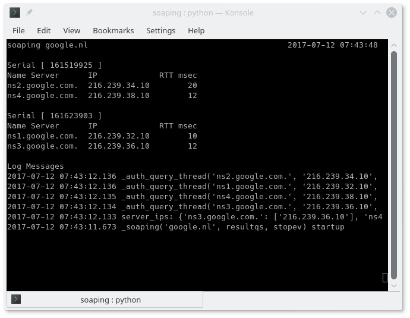

# soaping

_soaping_ means _"SOA ping"_.

Soaping sends DNS SOA queries to the name servers for a domain, and
saves the serial number, response time, and name server ID (NSID)
returned by each. This is useful for tracking DNS zone propagation
time to the authoritative servers for a domain.

## Installation

Soaping requires Python 3. The only additional requirement is the
[dnspython](http://www.dnspython.org/) package.

To get the code you can clone the GitHub repository:

    $ git clone https://github.com/shane-kerr/soaping.git

I like to use a virtual environment for installation. In Debian you
can do this as follows:

    $ sudo apt install python3-venv
    $ python3 -m venv venv
    $ . venv/bin/activate
    $ python3 -m pip install dnspython

For PyPy3 this is slightly different:

    $ pypy3 -m venv venv
    $ . venv/bin/activate
    $ python3 -m ensurepip
    $ python3 -m pip install dnspython
    $ python3 -m pip install selectors34

## Running

To run the program, specify the domain to watch:

    $ python3 soaping.py example.com

Any problems in execution will be printed to the console. Output is in
the `soaping.csv` file, which is rotated every 30 minutes.

Normally the system DNS resolver is used to find the name servers for
the domain, along with the IPv4 and IPv6 addresses of those name
servers. If you want to use an alternate DNS resolver, you can specify
this:

    $ python3 soaping.py -r 8.8.8.8 example.org

It also supports DNS over TLS, so you could monitor the Yeti root
servers at a privacy-protecting open resolver:

    $ python3 soaping.py -r 2001:4b98:dc2:43:216:3eff:fea9:41a --tls .

The `yeti-checkroot.sh` script is provided for this.
